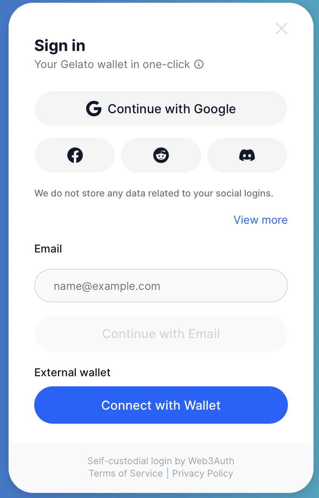

# ArtDrop | Inspire and create your own NFT collection

## Transform your ideas into stunning images to create and own your first ever AI-powered NFT, in just 2 clicks. 

&nbsp;

  

  
## Why this Product?

Most people never stepped in the world of Web3 with all the intricacies and jargons surrounding it. 
These exist in terms of:-
1. Creating and understanding Wallets, and managing Seed Phrases
2. Understanding how NFTs work, and how to create and access them
3. Jargon aroung Payments (in terms of pricing, chains, and gas fees)
4. Lack of entry points that make Web3 fun

## Features

1. ### No more remembering Seed Phrases powered by Web3Auth
    -  Login directly through your Socials (Gmail, facebook, discord etc.)
	-  Seamless Login Powered by Web3Auth
    - No need to create or connect Metamask wallet, we handle accounts for you.

2. ### Zero Transaction fees, Go Gasless with Gelato SDK 
    -  The NFTs you Mint are free, owned by you
    -  No transaction fees, we provide gas to fuel your creativity!
	-  Gas fees on us, by using Gelato's Gasless Onboarding 

3. ### No more manual transaction approvals, by Gnosis Safe
    - No need to sign and approve every transaction 
    - Account Abstraction acheived through Smart Contract Wallets provided by Gnosis Safe

4. ### Image Creation With Prompts using Stable Diffusion AI
    - Simply add a prompt to inspire the image you want to create
    - Get an NFT of the image you create rendered on the website

5. ### Secure, Fast and Reliable NFT Minting with Base Goerli
    - Mint the image you create with a single Click
    - Get the NFT in your account in just a couple of seconds

6. ### Access Across All Your Devices
    - Create and Mint your NFTs from anywhere, everywhere directly through mobile phones, tables or desktop devices
    - No app downloads (not even Metamask) to enter the world of Web3

7. ### Catalogue of all your creations
    - No need to go to Opensea to see what you possess
    - Find all the NFTs you create and mint, directly on the website under "View NFTs"

  

## Tech Stack 

-  Web3 Auth for enabling Social Login 
-  Gelato Gassless Wallet for sponsoring Gas Fees, making the app completely free to use
-  Base-Testnet for deploying NFT Smart Contract for NFT minting
-  Stable Diffusion AI @ Replicate for Image Generation
-  Chakra-UI for styling
-  NextJs for App Creation